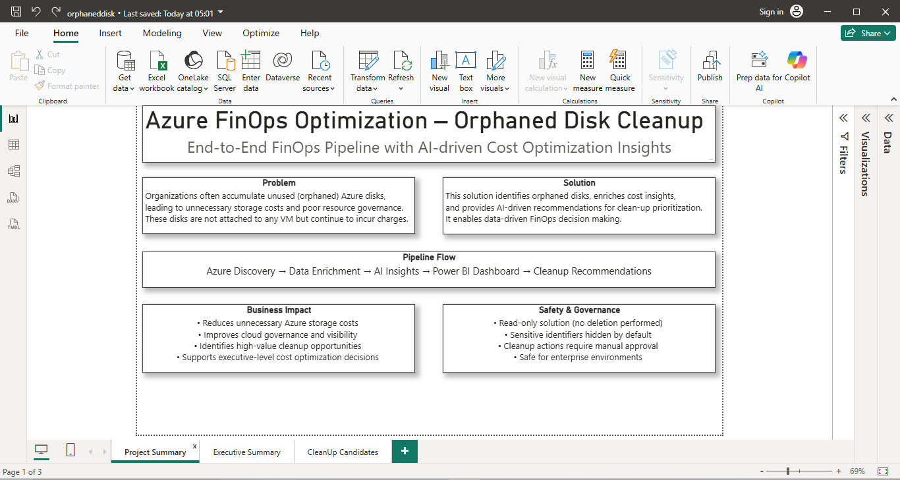
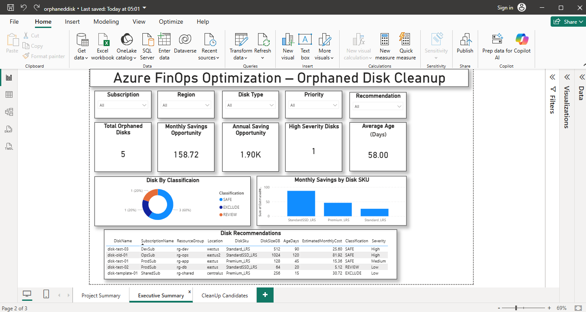
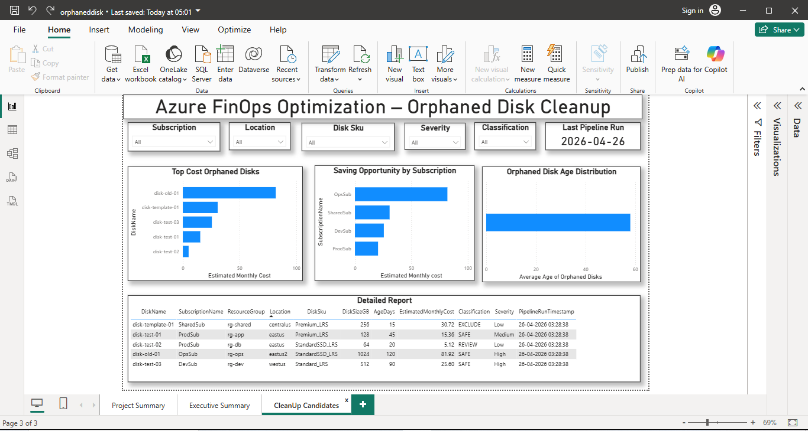

#  Power BI Dashboard – Azure FinOps Optimization

This document explains the Power BI dashboard used for analyzing orphaned Azure disks and identifying cost optimization opportunities.

---

##  Dashboard Overview

The dashboard is divided into **3 pages**:

1. Project Summary  
2. Executive Summary  
3. Cleanup Candidates  

---

# 1. Project Summary Page

##  Purpose
Provides a high-level overview of the solution, including problem statement, approach, and business value.

---

##  Key Sections

###  Problem
- Orphaned Azure disks continue to incur unnecessary storage costs  
- Leads to inefficient cloud resource utilization  

---

###  Solution
- Identifies orphaned disks  
- Enriches cost and usage insights  
- Provides AI-driven cleanup recommendations  

---

###  Pipeline Flow

Azure Discovery → Data Enrichment → AI Insights → Power BI Dashboard → Cleanup Recommendations

---

###  Business Impact
- Reduces unnecessary Azure storage costs  
- Improves cloud governance and visibility  
- Identifies high-value cleanup opportunities  
- Supports executive-level decision making  

---

###  Safety & Governance
- Read-only solution (no deletion performed)  
- Sensitive identifiers hidden by default  
- Cleanup requires manual approval  
- Safe for enterprise environments  

---

#  2. Executive Summary Page

##  Purpose
Provides a snapshot of key metrics and insights for stakeholders and decision-makers.

---

##  Filters

- Subscription  
- Location  
- Disk SKU  
- Severity  
- Classification  

---

##  Key KPIs

| Metric | Description |
|------|-------------|
| Total Orphaned Disks | Total number of unattached disks |
| Monthly Savings Opportunity | Estimated monthly cost savings |
| Annual Savings Opportunity | Estimated yearly savings |
| High Severity Disks | Disks with highest priority |
| Average Age (Days) | Average age of orphaned disks |

---

##  Visualizations

### 1. Disk Classification (Donut Chart)
- SAFE / REVIEW / EXCLUDE distribution  
- Helps understand cleanup readiness  

---

### 2. Monthly Savings by Disk SKU
- Shows cost distribution by disk type  
- Identifies high-cost disk categories  

---

### 3. Disk Recommendations Table

Includes:
- Disk Name  
- Subscription  
- Resource Group  
- Location  
- Disk SKU  
- Disk Size  
- Age (Days)  
- Estimated Monthly Cost  
- Classification  
- Severity  

---

##  Key Insights
- Identifies total savings potential  
- Highlights high-priority disks  
- Enables quick executive-level decisions  

---

#  3. Cleanup Candidates Page

##  Purpose
Focuses on actionable insights for cost optimization and cleanup planning.

---

##  Visualizations

### 1. Top Savings Opportunity Disks
- Displays highest cost orphaned disks  
- Helps prioritize cleanup  

---

### 2. Savings by Subscription
- Shows cost distribution across subscriptions  
- Identifies high-cost environments  

---

### 3. Orphaned Disk Age Distribution
- Highlights aging disks  
- Helps identify stale resources  

---

### 4. Detailed Report Table

Includes:
- Disk Name  
- Subscription  
- Resource Group  
- Location  
- Disk SKU  
- Disk Size  
- Age  
- Estimated Cost  
- Classification  
- Severity  
- Pipeline Timestamp  

---

## 📌 Key Insights
- Identifies top cleanup candidates  
- Enables cost-focused prioritization  
- Supports operational decision making  

---

#  Overall Insights

- Majority of disks fall under SAFE classification  
- High severity disks contribute most to cost  
- Significant savings opportunity exists  

---

#  Refresh Process

1. Open the `.pbix` file from `powerbi/`  
2. Click **Refresh**  
3. Validate visuals  
4. Save the report  

---

#  Data Safety

- No delete operations performed  
- Sensitive data masked  
- Safe for demo and enterprise use  
